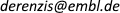
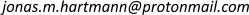

# opto-notch-adaptation

This repo hosts the code for the quantitative image analysis and Ordinary Differential Equation (ODE) modelling in the paper **"Desensitisation of Notch signalling through dynamic adaptation in the nucleus"** by Viswanathan, Hartmann and colleagues. All code was written by Jonas Hartmann.

### Repository Structure

- `Notebooks/` is where most of the important code is.
  - `DEV`: Initial development of image quantification pipelines.
  - `RUN`: Batch execution of the image quantification pipelines.
  - `ANA`: Downstream analysis of quantified image data.
  - `MOD`: The ODE modelling and its analysis.
- `optonotch/` is a package into which some frequently used functions have been refactored.
  - `optonotch.utilities`: Various utilities used in various places.
  - `optonotch.modeling`: Data loading, input functions and loss functions for the modelling.
- `Data/` houses the data used.
  - `Images/`: Input image data. Required only for `DEV` and `RUN` notebooks. Not hosted on GitHub due to file size; please contact Jonas Hartmann for more information.
  - `Measurements/`: Derived values. Required for `ANA` and `MOD` notebooks. Included in this repository.
- `Figures/`: Figures generated by the code. 
  - These are "raw" plots used for figure construction; composition, axis labels and other annotations may be slightly different in the published paper figures.
- `Illustrations/` contain some images used in markdown annotations in some places.

### Data Flow

1. Raw images were prepared by z-projection where appropriate.

2. `RUN` notebooks ingest images and produce measurements.

3. `ANA` notebooks produce figures from these measurements.

  - `ANA - sim spot detection.ipynb` also generates and saves a cleaned version of some measurements for use in modelling!
  - `ANA - nuclear nicd bleaching.ipynb` also infers the bleaching constant of mCherry for use in fitting the NICD import-export models.

  - `ANA - nuclear nicd measurement.ipynb` also fits NICD import-export models for use in modelling!

4. `MOD` notebooks fit the various models that were tested and produce figures from them.

### Dependencies

- Python 3.7.3 (I used and recommend the [Anaconda distribution](https://www.anaconda.com/distribution/))
- `jupyter==7.6.1` and `ipython==7.6.1`
- Scientific python stack, most importantly:
  - `jupyter==1.0.0`
  - `numpy==1.16.4`
  - `scipy==1.2.1`
  - `pandas==0.24.2`
  - `matplotlib==3.1.0`
  - `scikit-image==0.15.0`
  - `sympy==1.4`
- Oh, and `dill==0.3.3`

### Contact and Support

- The study's lead author is Stefano De Renzis at . Please contact him to request any non-computational materials, resources or reagents,
- For questions regarding the code and computational resources, please contact Jonas Hartmann at or open an issue on GitHub. Note that I cannot promise support for any use cases other than direct reproduction of the study's results.

